# INVASION !! - Projet de C


# 🔗 Dépendances

Installation des dépendances [SDL2](https://github.com/libsdl-org/SDL/releases/tag/release-3.2.0)

```bash
sudo apt-get install libsdl2-dev
sudo apt-get install libsdl2-image-dev
sudo apt-get install libsdl2-mixer-dev
sudo apt-get install libsdl2-ttf-dev
```

En cas d'erreurs
```bash
sudo apt update
```
```bash
sudo apt --fix-missing update
sudo apt install -f
```

---

# ⚙️ Compilation

Compilation à l’aide de [GCC 13.3](https://gcc.gnu.org/gcc-13/), nous compilons à l’aide d’un Makefile.

## 📜 Makefile

Permet de compiler tout à la fois, il suffit d’entrer la commande `make` .

```bash
make
```

## 🎮 Lancer le jeu / un niveau

La prochaine étape est de lancer un niveau.

- `make foobar` où *foobar* est un niveau (facile, difficile, expert, impossible ou survie).

```bash
make impossible
```

## 🧹 Nettoyage

- Nettoyage standard

```bash
make clean
```

- Nettoyage complet

```bash
make cleanAll
```

---

# Architecture

```mermaid
graph TD
    F[main.c]

    F --> F1[io.c]
    F --> F2[jeu.c]
    F --> F4[video.c]

    F1 -->|lit/écrit| H[Terminal]
    F1 -->|communique avec| F2
    F4 -->|récupère| G[tex]
    F4 -->|SDL_image| I[Fenêtre Graphique] 
```

